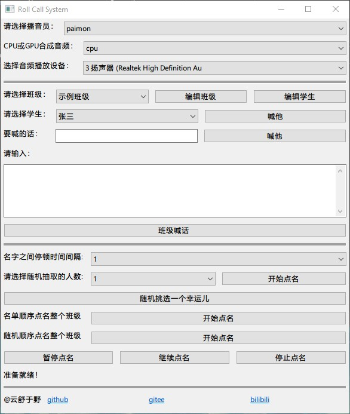

# Roll-call-system

# 声明

- 鸣谢<a herf="https://github.com/CjangCjengh/vits.git">vits</a>

- 本项目paimon语音音色模型所有权归原神母公司<a href="https://www.mihoyo.com/">米哈游</a>yunfei的语音模型归<a herf="https://space.bilibili.com/25876945/">极客湾</a>所有 禁止用于商业用途 仅限于交流学习

- 如果想增加自己的角色模型需要自行炼丹

- 添加自己的vits模型：
在TTS/models中新建一个文件夹，文件夹支持中英文命名，文件夹里面需包含*.json和*.pth两个文件，启动软件会自动加载模型

- 使用GPU合成音频，至少需要一张Nvidia显卡并且cuda>=11.8

# 初衷

属于给自己填坑了。之前在俺爹面前夸下海口，就这样的学生点名软件，我两三天就能写一个。结果鏖战4天才完成。

目前的缺陷就是，没有使用中文表现最优秀的端到端text2audio项目，如果使用bert-vits的模型来合成语音，语气会更拟人，更加有情感些。代码的解耦性还是做到了，要使用别的端到端语音合成其实只需要重写PlayVoice类就可以了。

# 实现细节

程序主要通过wxPython实现UI，字典序列化保存班级名单，configparser实现用户偏好读取和保存，所有耗时的音频合成都开辟新线程去执行的方式，防止主程序界面被阻塞。通过threading.Event()事件实现主线程和子线程通信，从而实现点名线程的阻塞，继续和终止。通过tkinter库实现UI界面：一个转盘显示选中班级的所有学生，点击按钮就会抽取一名学生。

- BackUp类：用于序列化持久保存班级名单

- PlayVoice类：搜索所有可用的tts模型、获取所有的演员列表、合成音频、设置音频合成设备、通过指定设备播放音频

- EditClass类：用于绘制编辑班级信息的UI界面，通过控件绑定的方法控制主类的班级数据

- EditStudents类：用于绘制编辑学生信息的UI界面，通过控件绑定的方法控制主类的学生名单数据

- LoadConfig类：用于加载和保存用户习惯，比如上次关闭前：停顿时间、音频合成硬件、播音员、选择的班级

- MyFrame类:绘制主程序窗口，是各种核心方法和数据的组织和管理者，是程序的入口

- Roulette类：用于绘制随机抽取一个幸运儿页面，和抽取幸运儿逻辑

# 界面

<p align="center"> <div align="middle"></div></p>


# 软件功能

- 支持加入自己的语音合成模型
- 同时支持CUDA和CPU合成音频，可自行选择
- 支持自动检索设备音频输出设备列表，并选择指定音频输出设备
输出音频
- 支持设置点名多个学生的时间间隔
- 支持点名单指定学生、对指定学生喊话、班级喊话、随机抽多个学生点名、班级顺序点名、班级随机顺序点名
- 支持顺序点名和随机点名流程暂停、继续和终止
- 支持转盘随机抽取一个学生


# 环境

python==3.10.6

```
cuda:
.\env\Scripts\python.exe -m pip install torch==2.0.0+cu118 torchvision torchaudio -f https://mirror.sjtu.edu.cn/pytorch-wheels/torch_stable.html

python.exe -m pip install torch==2.0.0+cu118 torchvision torchaudio -f https://mirror.sjtu.edu.cn/pytorch-wheels/torch_stable.html

```
<!-- cpu:
.\env\Scripts\python.exe -m pip install torch torchvision torchaudio -i https://pypi.tuna.tsinghua.edu.cn/simple

python.exe -m pip install torch torchvision torchaudio -i https://pypi.tuna.tsinghua.edu.cn/simple -->

# 编译

## windows


#### 原生python

```
pip install torch torchvision torchaudio --index-url https://download.pytorch.org/whl/cu118

pip install -r requirements.txt -i https://pypi.tuna.tsinghua.edu.cn/simple

pip install update pyinstaller

pyinstaller --noconfirm --noconsole --onedir main.py --name RoolCallSystem
```

#### 虚拟环境

```
cd 'Roll call system'
python -m venv venv

.\venv\Scripts\python.exe -m pip install torch torchvision torchaudio --index-url https://download.pytorch.org/whl/cu118

.\venv\Scripts\python.exe -m pip install -r requirements.txt -i https://pypi.tuna.tsinghua.edu.cn/simple

.\venv\Scripts\python.exe -m pip install update pyinstaller

.\venv\Scripts\python.exe -m pyinstaller --noconfirm --noconsole --onedir main.py --name RoolCallSystem
```


<!-- .\env\Scripts\python.exe pyinstaller --noconsole main.py --name RoolCallSystem -->
<!-- 
## Linux

```
cd Roll-call-system
python3 -m venv venv  # 创建虚拟环境
source venv/bin/activate  # 激活虚拟环境

pip3 install torch torchvision torchaudio --index-url https://download.pytorch.org/whl/cu118  # 安装pytorch

pip3 install torch torchvision torchaudio --index-url https://download.pytorch.org/whl/cu118

pip3 install -r requirements.txt -i https://pypi.tuna.tsinghua.edu.cn/simple

pip3 install update pyinstaller

pyinstaller --noconfirm --noconsole --onedir main.py --name RoolCallSystem
```

```
cd Roll-call-system
python3 -m venv venv  # 创建虚拟环境
source venv/bin/activate  # 激活虚拟环境

sudo -H pip3 install torch torchvision torchaudio --index-url https://download.pytorch.org/whl/cu118

.\venv\Scripts\python.exe -m pip install torch torchvision torchaudio --index-url https://download.pytorch.org/whl/cu118

.\venv\Scripts\python.exe -m pip install -r requirements.txt -i https://pypi.tuna.tsinghua.edu.cn/simple

pip install update pyinstaller

pyinstaller --noconfirm --noconsole --onedir main.py --name RoolCallSystem
``` -->
